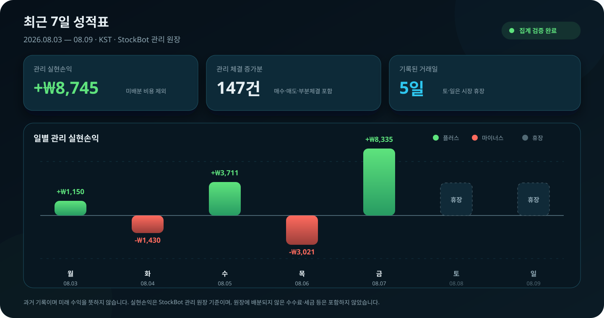

# 개미親주식

> 주식하기가 싫어서, AI에게 맡겨 보기로 했습니다.

## 1. 이걸 만든 의도

솔직히 말하면, **주식하기가 싫었습니다.**

종목을 찾고, 사고, 계속 지켜보고, 팔 때를 기다리는 일을 매일 반복하고 싶지 않았습니다. 그러다 이런 생각이 들었습니다.

> **“AI가 나보다 똑똑한데, 주식도 나보다 잘하지 않을까?”**

그래서 만들었습니다. 미래를 맞히는 마법보다는, 사람이 지치기 쉬운 반복을 정해진 조건대로 꾸준히 실행하는 엔진입니다.

## 2. 최근 7일 성적표

이 수치는 **2026년 8월 3일~8월 9일(KST)** 동안 StockBot이 관리한 실거래 원장에서 집계했습니다. `147건`은 매수·매도·부분체결을 모두 포함한 **체결 증가분**이며, StockBot 관리 원장에 배분되지 않은 수수료·세금 등은 제외했습니다. 과거 기록이지 미래 수익을 보장하지 않습니다.

## 3. 원리

실시간으로 모인 주식 후보를 **거래량이 많은 순서**로 세웁니다. 위에서부터 우리의 거래 조건에 맞는 종목만 솎아내 매수합니다. 산 종목은 계속 감시하고, 거래 조건을 벗어나면 매도합니다. 빈자리가 생기면 다시 거래량 순위의 위쪽부터 찾습니다.

**찾고 → 사고 → 지켜보고 → 팔고 → 다시 찾기. 이 과정을 계속 반복합니다.**
