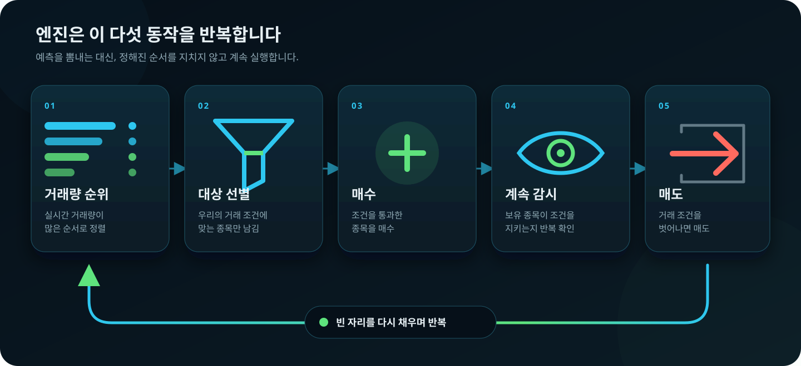

# 개미親주식

> 주식하기가 싫어서, AI에게 맡겨 보기로 했습니다.

 
 

## 1. 계기

**주식하기가 싫어서 만들었습니다.**

종목을 찾고, 사고, 계속 지켜보고, 팔 때를 기다리는 일을 매일 반복하고 싶지 않았습니다. 그러다 이런 생각이 들었습니다.

> **“AI가 나보다 똑똑한데, 주식도 나보다 잘하지 않을까?”**

그래서 만들었습니다. 

## 2. 최근 7일 성적표

이 수치는 **2026년 8월 3일~8월 7일(KST)** 동안 원금 9만원으로 운영했습니다. `총 147건`은 매수·매도·부분체결을 모두 포함한 **체결 건수** 입니다.

## 3. 원리

실시간으로 모인 주식 후보를 **거래량이 많은 순서**로 세웁니다. 위에서부터 우리의 거래 조건에 맞는 종목만 솎아내 매수합니다. 산 종목은 계속 감시하고, 거래 조건을 벗어나면 매도합니다. 빈자리가 생기면 다시 거래량 순위의 위쪽부터 찾습니다.

**찾고 → 사고 → 지켜보고 → 팔고 → 다시 찾기. 이 과정을 계속 반복합니다.**
